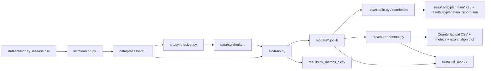

# CKD Risk Prediction — Detailed Implementation Summary

This document is a **grounded, artifact-backed** summary of how the CKD Risk Prediction project is implemented. It connects:

- **Code**: modules in [src/](src/)
- **Execution**: notebooks in [notebooks/](notebooks/) and helper scripts in [scripts/](scripts/)
- **Produced artifacts**: processed/synthetic datasets, trained models, metrics tables, explanation reports, and plots under [data/](data/), [models/](models/), and [results/](results/)

> The project intentionally constrains all modeling/explanation/counterfactual work to a **6-feature canonical schema** aligned to a “paper-style” feature set.

---

## 1) Repository map (what each folder contains)

### Inputs
- Raw dataset: [dataset/kidney_disease.csv](dataset/kidney_disease.csv)

### Processed (real) data artifacts
- Cleaned dataset: [data/processed/kidney_disease_cleaned.csv](data/processed/kidney_disease_cleaned.csv)
- Raw splits + imputed raw splits: [data/processed/splits/](data/processed/splits/)
- Canonical preprocessed matrices + canonical feature list:
  - [data/processed/preprocessed/X_train_preproc.csv](data/processed/preprocessed/X_train_preproc.csv)
  - [data/processed/preprocessed/X_test_preproc.csv](data/processed/preprocessed/X_test_preproc.csv)
  - [data/processed/preprocessed/feature_names.json](data/processed/preprocessed/feature_names.json)

### Synthetic data artifacts
- Synthetic canonical preprocessed features + labels: [data/synthetic/](data/synthetic/)
  - Example: [data/synthetic/X_synth_3x_gcopula_preproc.csv](data/synthetic/X_synth_3x_gcopula_preproc.csv)
  - Example: [data/synthetic/y_synth_3x_gcopula.csv](data/synthetic/y_synth_3x_gcopula.csv)

### Models
- Serialized models: [models/](models/)
- Saved canonical preprocessor: [models/preprocessor.pkl](models/preprocessor.pkl)

### Results & reports
- Metric tables + explanation reports: [results/](results/)
- Plots/figures: [results/plots/](results/plots/)

### Execution / orchestration
- Notebooks (analysis + reporting): [notebooks/](notebooks/)
- Helper scripts: [scripts/](scripts/)
- Streamlit application: [streamlit_app.py](streamlit_app.py)

---

## 2) End-to-end workflow (data → models → explanations → counterfactuals)

Key principle: **everything that touches models uses a strict canonical schema**.

---

## 3) Shared design decisions and invariants

### 3.1 Canonical feature space (6 features)
Defined and enforced in [src/canonical.py](src/canonical.py):

- `hemo` (Hemoglobin)
- `sc` (Serum creatinine)
- `al` (Albumin)
- `htn` (Hypertension flag)
- `age`
- `dm` (Diabetes flag)

The code is defensive about schema drift:
- It asserts the exact set and order of canonical columns.
- It rejects accidental one-hot remnants (e.g., `htn_0`, `dm_1`) to keep explanations and counterfactual constraints stable.

### 3.2 Clinical bounds + counterfactual constraints
Centralized in [src/config.py](src/config.py):
- **Clinical bounds** (min/max) used to clip and validate numeric features.
- **Non-actionable** vs actionable columns (e.g., age typically treated as non-actionable).
- **Monotonic direction hints** for counterfactual search (e.g., some features may be constrained to only move in one clinically plausible direction).

### 3.3 Leakage safety
The pipeline tries to avoid data leakage through:
- Split-time stratification + fixed seed.
- Train-only fitting for regression-based imputation.
- **Fold-local synthesis** for augmented cross-validation (synthetic samples are generated from each fold’s training portion only).
- Explicit overlap checks using row hashing (guard against train/test contamination).

---

## 4) Data preparation implementation

### 4.1 Cleaning + splitting + train-only imputation
Implemented in [src/cleaning.py](src/cleaning.py).

What it does (high level):
1. Load raw CSV from [dataset/](dataset/).
2. Normalize missing markers (e.g., `?` → NaN), trim strings.
3. Coerce numeric columns.
4. Normalize categorical/binary fields to stable numeric encodings.
5. Build `target` safely from `classification` (avoids the classic `ckd` substring-in-`notckd` pitfall).
6. Create stratified train/test split.
7. Fit regression-based imputers on **train only**, then transform train/test.
8. Produce canonical feature matrices and persist them.

Key outputs:
- Cleaned: [data/processed/kidney_disease_cleaned.csv](data/processed/kidney_disease_cleaned.csv)
- Splits: [data/processed/splits/](data/processed/splits/)
- Canonical preprocessed:
  - [data/processed/preprocessed/X_train_preproc.csv](data/processed/preprocessed/X_train_preproc.csv)
  - [data/processed/preprocessed/X_test_preproc.csv](data/processed/preprocessed/X_test_preproc.csv)
  - [data/processed/preprocessed/feature_names.json](data/processed/preprocessed/feature_names.json)
- Preprocessor object: [models/preprocessor.pkl](models/preprocessor.pkl)

### 4.2 Canonical preprocessing object
Implemented in [src/canonical.py](src/canonical.py).

`CanonicalPreprocessor` is used to:
- enforce schema
- apply simple imputation defaults (median/mode) where needed
- coerce binary flags to stable 0/1 values

This is the final gate that ensures downstream models always see the same 6 columns.

---

## 5) Synthetic data generation (Gaussian Copula augmentation)

Implemented in [src/synthesizer.py](src/synthesizer.py).

### 5.1 Generator
- Uses a **class-conditional Gaussian Copula** approach:
  - fit one copula to class 0 (Not CKD)
  - fit another copula to class 1 (CKD)
  - sample each class and concatenate

### 5.2 Post-processing
Synthetic rows are post-processed to satisfy modeling + clinical constraints:
- clip numeric values to clinical bounds
- force `htn` and `dm` into {0,1}
- snap quasi-ordinal columns (when applicable)
- re-apply canonical preprocessing to guarantee the final CSV matches canonical expectations

### 5.3 Quality control (QC)
Saved QC artifacts in [results/](results/):

- 1× augmentation QC: [results/qc_report_1x_gcopula_seed42.csv](results/qc_report_1x_gcopula_seed42.csv)
  - `avg_ks=0.035714...`, `mean_corr_diff=0.033757...`, `discriminator_auc=0.436407...`
- 3× augmentation QC: [results/qc_report_3x_gcopula_seed42.csv](results/qc_report_3x_gcopula_seed42.csv)
  - `avg_ks=0.026388...`, `mean_corr_diff=0.027841...`, `discriminator_auc=0.420610...`

Per-feature KS reports:
- [results/ks_1x_gcopula_seed42.csv](results/ks_1x_gcopula_seed42.csv)
- [results/ks_3x_gcopula_seed42.csv](results/ks_3x_gcopula_seed42.csv)

Synthetic datasets:
- [data/synthetic/X_synth_1x_gcopula_preproc.csv](data/synthetic/X_synth_1x_gcopula_preproc.csv)
- [data/synthetic/X_synth_3x_gcopula_preproc.csv](data/synthetic/X_synth_3x_gcopula_preproc.csv)
- [data/synthetic/y_synth_1x_gcopula.csv](data/synthetic/y_synth_1x_gcopula.csv)
- [data/synthetic/y_synth_3x_gcopula.csv](data/synthetic/y_synth_3x_gcopula.csv)

---

## 6) Model training & evaluation implementation

Implemented in [src/train.py](src/train.py).

### 6.1 Models
The repo contains trained instances for:
- Logistic Regression (`lr_*.joblib`)
- Random Forest (`rf_*.joblib`)
- XGBoost (`xgb_*.joblib`)

See [models/](models/) for the concrete set of serialized models.

Concrete model inventory in this workspace:
- Baseline models:
  - [models/lr_baseline.joblib](models/lr_baseline.joblib)
  - [models/rf_baseline.joblib](models/rf_baseline.joblib)
  - [models/xgb_baseline.joblib](models/xgb_baseline.joblib)
- 1× augmentation models:
  - [models/lr_1x.joblib](models/lr_1x.joblib)
  - [models/rf_1x.joblib](models/rf_1x.joblib)
  - [models/xgb_1x.joblib](models/xgb_1x.joblib)
- 3× augmentation models:
  - [models/lr_3x.joblib](models/lr_3x.joblib)
  - [models/rf_3x.joblib](models/rf_3x.joblib)
  - [models/xgb_3x.joblib](models/xgb_3x.joblib)
- “Augmented seed 42” (custom augmented runs used in report plots):
  - [models/lr_augmented_42.joblib](models/lr_augmented_42.joblib)
  - [models/lr_augmented_42_v1.joblib](models/lr_augmented_42_v1.joblib)
  - [models/rf_augmented_42.joblib](models/rf_augmented_42.joblib)
  - [models/rf_augmented_42_v1.joblib](models/rf_augmented_42_v1.joblib)
  - [models/xgb_augmented_42.joblib](models/xgb_augmented_42.joblib)
  - [models/xgb_augmented_42_v1.joblib](models/xgb_augmented_42_v1.joblib)
- Additional convenience models:
  - [models/lr.joblib](models/lr.joblib)
  - [models/rf.joblib](models/rf.joblib)
  - [models/xgb.joblib](models/xgb.joblib)
- Bundled model collections:
  - [models/models_augmented_42.joblib](models/models_augmented_42.joblib)
  - [models/models_augmented_42_v1.joblib](models/models_augmented_42_v1.joblib)

### 6.2 Variants / scenarios
The project compares:
- **Real Only** (baseline)
- **Real + Synthetic** (augmented; multiple augmentation sizes and seeds)

On-disk artifacts include multiple augmented naming conventions (e.g. `*_1x`, `*_3x`, `*_augmented_42`, `*_augmented_42_v1`).

This repo also records multiple **feature-set configurations** (used in some experiments/notebooks):
- [results/feature_sets.json](results/feature_sets.json)
  - `feat6`: the canonical 6-feature set (used by the main pipeline)
  - `feat13`: an alternate 13-feature set (used for comparative experiments)

### 6.3 Evaluation modes
Two evaluation regimes appear in this repository:

1) **Strict cross-validation (CV) with fold-local processing**
- Written out as:
  - [results/cv_metrics_baseline.csv](results/cv_metrics_baseline.csv)
  - [results/cv_metrics_1x_gcopula.csv](results/cv_metrics_1x_gcopula.csv)
  - [results/cv_metrics_3x_gcopula.csv](results/cv_metrics_3x_gcopula.csv)

2) **Holdout (train on train split, evaluate on test split)**
- Consolidated report with both holdout and CV side-by-side:
  - [results/metrics_comparison_all_models_holdout_and_cv.csv](results/metrics_comparison_all_models_holdout_and_cv.csv)

Example rows (from the saved report):
- `RF, Real + Synthetic` has holdout accuracy/precision/recall/F1/AUC all equal to `1.0`.
- `XGB, Real + Synthetic` has holdout accuracy/precision/recall/F1/AUC all equal to `1.0`.

A CV-only consolidated comparison also exists:
- [results/metrics_comparison_all_models.csv](results/metrics_comparison_all_models.csv)

---

## 7) Explanation pipeline (SHAP, LIME, and stability metrics)

### 7.1 SHAP extraction script
Implemented in [src/explain.py](src/explain.py).

Key behaviors:
- Loads [data/processed/preprocessed/X_test_preproc.csv](data/processed/preprocessed/X_test_preproc.csv)
- Loads a specified trained model from [models/](models/)
- Computes SHAP using a model-appropriate explainer:
  - trees: `TreeExplainer`
  - logistic regression: `LinearExplainer` or fallback
- Normalizes the wide variety of SHAP output shapes to a consistent `(n_samples, n_features)` matrix

### 7.2 Explanation evaluation metrics
Implemented in [src/explanation_metrics.py](src/explanation_metrics.py).

Saved artifacts (precomputed in this repo):
- [results/explanation_metrics.csv](results/explanation_metrics.csv)
- [results/explanation_stability_metrics.csv](results/explanation_stability_metrics.csv)
- [results/lime_stability_metrics.csv](results/lime_stability_metrics.csv)
- [results/all_explanation_metrics.csv](results/all_explanation_metrics.csv)

Summary report JSON (includes ESS-by-model and rank-change analysis):
- [results/explanation_report.json](results/explanation_report.json)

Notable stored values in that report:
- `ess_by_model.lr.real = 0.8095`, `ess_by_model.lr.augmented = 0.7143`
- `ess_by_model.rf.real = 0.4286`, `ess_by_model.rf.augmented = 0.0857`
- `ess_by_model.xgb.real = 0.8571`, `ess_by_model.xgb.augmented = -0.0857`

Interpretation: augmentation can change not just accuracy metrics but also explanation stability/consistency.

### 7.3 Notebook-driven explanation plots
The bulk of “report-ready” plots are produced by [notebooks/CKD_Model_Explanations.ipynb](notebooks/CKD_Model_Explanations.ipynb) and saved into:
- [results/plots/](results/plots/)

Full inventory of `results/plots/` committed artifacts:

- LIME aggregate plots:
  - [results/plots/lime_agg__logistic_regression__augmented.png](results/plots/lime_agg__logistic_regression__augmented.png)
  - [results/plots/lime_agg__logistic_regression__regular.png](results/plots/lime_agg__logistic_regression__regular.png)
  - [results/plots/lime_agg__random_forest__augmented.png](results/plots/lime_agg__random_forest__augmented.png)
  - [results/plots/lime_agg__random_forest__regular.png](results/plots/lime_agg__random_forest__regular.png)
  - [results/plots/lime_agg__xgboost__augmented.png](results/plots/lime_agg__xgboost__augmented.png)
  - [results/plots/lime_agg__xgboost__regular.png](results/plots/lime_agg__xgboost__regular.png)

- LIME single-instance plots:
  - [results/plots/lime_single__logistic_regression__augmented.png](results/plots/lime_single__logistic_regression__augmented.png)
  - [results/plots/lime_single__logistic_regression__regular.png](results/plots/lime_single__logistic_regression__regular.png)
  - [results/plots/lime_single__random_forest__augmented.png](results/plots/lime_single__random_forest__augmented.png)
  - [results/plots/lime_single__random_forest__regular.png](results/plots/lime_single__random_forest__regular.png)
  - [results/plots/lime_single__xgboost__augmented.png](results/plots/lime_single__xgboost__augmented.png)
  - [results/plots/lime_single__xgboost__regular.png](results/plots/lime_single__xgboost__regular.png)

- Report-ready LIME for selected patients/models:
  - [results/plots/report_lime_patient0__rf_augmented_42_v1.png](results/plots/report_lime_patient0__rf_augmented_42_v1.png)
  - [results/plots/report_lime_patient1__rf_augmented_42_v1.png](results/plots/report_lime_patient1__rf_augmented_42_v1.png)
  - [results/plots/report_lime_patient8__rf_augmented_42_v1.png](results/plots/report_lime_patient8__rf_augmented_42_v1.png)
  - [results/plots/report_lime_patient10__rf_augmented_42_v1.png](results/plots/report_lime_patient10__rf_augmented_42_v1.png)
  - [results/plots/report_lime_patient0__xgb_baseline.png](results/plots/report_lime_patient0__xgb_baseline.png)

- Report-ready SHAP force plots (HTML + PNG):
  - [results/plots/report_shap_force_patient0__rf_augmented_42_v1.html](results/plots/report_shap_force_patient0__rf_augmented_42_v1.html)
  - [results/plots/report_shap_force_patient0__rf_augmented_42_v1.png](results/plots/report_shap_force_patient0__rf_augmented_42_v1.png)
  - [results/plots/report_shap_force_patient1__rf_augmented_42_v1.html](results/plots/report_shap_force_patient1__rf_augmented_42_v1.html)
  - [results/plots/report_shap_force_patient1__rf_augmented_42_v1.png](results/plots/report_shap_force_patient1__rf_augmented_42_v1.png)
  - [results/plots/report_shap_force_patient8__rf_augmented_42_v1.html](results/plots/report_shap_force_patient8__rf_augmented_42_v1.html)
  - [results/plots/report_shap_force_patient8__rf_augmented_42_v1.png](results/plots/report_shap_force_patient8__rf_augmented_42_v1.png)
  - [results/plots/report_shap_force_patient10__rf_augmented_42_v1.html](results/plots/report_shap_force_patient10__rf_augmented_42_v1.html)
  - [results/plots/report_shap_force_patient10__rf_augmented_42_v1.png](results/plots/report_shap_force_patient10__rf_augmented_42_v1.png)
  - [results/plots/report_shap_force_patient0__xgb_baseline.html](results/plots/report_shap_force_patient0__xgb_baseline.html)
  - [results/plots/report_shap_force_patient0__xgb_baseline.png](results/plots/report_shap_force_patient0__xgb_baseline.png)

- Report-ready SHAP global plots:
  - [results/plots/report_shap_summary__rf_augmented_42_v1.png](results/plots/report_shap_summary__rf_augmented_42_v1.png)
  - [results/plots/report_shap_global_importance__rf_augmented_42_v1.png](results/plots/report_shap_global_importance__rf_augmented_42_v1.png)
  - [results/plots/report_shap_summary__xgb_baseline.png](results/plots/report_shap_summary__xgb_baseline.png)
  - [results/plots/report_shap_global_importance__xgb_baseline.png](results/plots/report_shap_global_importance__xgb_baseline.png)

- SHAP dependence plots:
  - Logistic regression (regular/augmented):
    - [results/plots/shap_dependence__logistic_regression_augmented__age.png](results/plots/shap_dependence__logistic_regression_augmented__age.png)
    - [results/plots/shap_dependence__logistic_regression_augmented__al.png](results/plots/shap_dependence__logistic_regression_augmented__al.png)
    - [results/plots/shap_dependence__logistic_regression_augmented__dm.png](results/plots/shap_dependence__logistic_regression_augmented__dm.png)
    - [results/plots/shap_dependence__logistic_regression_augmented__hemo.png](results/plots/shap_dependence__logistic_regression_augmented__hemo.png)
    - [results/plots/shap_dependence__logistic_regression_augmented__sc.png](results/plots/shap_dependence__logistic_regression_augmented__sc.png)
    - [results/plots/shap_dependence__logistic_regression_regular__al.png](results/plots/shap_dependence__logistic_regression_regular__al.png)
    - [results/plots/shap_dependence__logistic_regression_regular__hemo.png](results/plots/shap_dependence__logistic_regression_regular__hemo.png)
    - [results/plots/shap_dependence__logistic_regression_regular__sc.png](results/plots/shap_dependence__logistic_regression_regular__sc.png)

  - Random forest (regular/augmented):
    - [results/plots/shap_dependence__random_forest_augmented__al.png](results/plots/shap_dependence__random_forest_augmented__al.png)
    - [results/plots/shap_dependence__random_forest_augmented__dm.png](results/plots/shap_dependence__random_forest_augmented__dm.png)
    - [results/plots/shap_dependence__random_forest_augmented__hemo.png](results/plots/shap_dependence__random_forest_augmented__hemo.png)
    - [results/plots/shap_dependence__random_forest_augmented__sc.png](results/plots/shap_dependence__random_forest_augmented__sc.png)
    - [results/plots/shap_dependence__random_forest_regular__al.png](results/plots/shap_dependence__random_forest_regular__al.png)
    - [results/plots/shap_dependence__random_forest_regular__hemo.png](results/plots/shap_dependence__random_forest_regular__hemo.png)
    - [results/plots/shap_dependence__random_forest_regular__sc.png](results/plots/shap_dependence__random_forest_regular__sc.png)

  - XGBoost (regular/augmented):
    - [results/plots/shap_dependence__xgboost_augmented__al.png](results/plots/shap_dependence__xgboost_augmented__al.png)
    - [results/plots/shap_dependence__xgboost_augmented__dm.png](results/plots/shap_dependence__xgboost_augmented__dm.png)
    - [results/plots/shap_dependence__xgboost_augmented__hemo.png](results/plots/shap_dependence__xgboost_augmented__hemo.png)
    - [results/plots/shap_dependence__xgboost_augmented__htn.png](results/plots/shap_dependence__xgboost_augmented__htn.png)
    - [results/plots/shap_dependence__xgboost_augmented__sc.png](results/plots/shap_dependence__xgboost_augmented__sc.png)
    - [results/plots/shap_dependence__xgboost_regular__al.png](results/plots/shap_dependence__xgboost_regular__al.png)
    - [results/plots/shap_dependence__xgboost_regular__hemo.png](results/plots/shap_dependence__xgboost_regular__hemo.png)
    - [results/plots/shap_dependence__xgboost_regular__sc.png](results/plots/shap_dependence__xgboost_regular__sc.png)

- SHAP summary plots (regular vs augmented):
  - [results/plots/shap_summary__logistic_regression__augmented.png](results/plots/shap_summary__logistic_regression__augmented.png)
  - [results/plots/shap_summary__logistic_regression__regular.png](results/plots/shap_summary__logistic_regression__regular.png)
  - [results/plots/shap_summary__random_forest__augmented.png](results/plots/shap_summary__random_forest__augmented.png)
  - [results/plots/shap_summary__random_forest__regular.png](results/plots/shap_summary__random_forest__regular.png)
  - [results/plots/shap_summary__xgboost__augmented.png](results/plots/shap_summary__xgboost__augmented.png)
  - [results/plots/shap_summary__xgboost__regular.png](results/plots/shap_summary__xgboost__regular.png)

- RF importance comparison plot:
  - [results/plots/rf_feature_importance_mirror__regular_vs_augmented.png](results/plots/rf_feature_importance_mirror__regular_vs_augmented.png)

---

## 8) Counterfactual generation implementation

Implemented in [src/counterfactual.py](src/counterfactual.py).

### 8.1 Goal
Given a patient in canonical space, produce a small set of candidate **counterfactuals** that flip the model prediction to a desired target class (typically **Not CKD**), while remaining clinically plausible and “close” to the original patient.

### 8.2 Algorithm overview
The counterfactual search is **gradient-free** and built around:
- constraint enforcement (bounds, immutables, directional constraints)
- a multi-objective scoring function
- iterative hill-climbing with restarts
- Pareto filtering to select non-dominated solutions

Core elements:
- **Validity**: does prediction flip?
- **Proximity**: distance to original (supports `zscore` mode using training std)
- **Sparsity**: number of features changed
- **Robustness**: whether flip persists under slight perturbations/noise
- **Clinical plausibility**: adheres to bounds and actionable constraints

### 8.3 Outputs
The API returns:
- a `DataFrame` of counterfactual feature rows
- a `DataFrame` of metrics per candidate
- an `explanation` dict (includes probabilities and clinical text)
- a “comparison” table between original and chosen best counterfactual

### 8.4 Notebook demo
The user-facing demo notebook is [notebooks/CKD_Counterfactual_Demo.ipynb](notebooks/CKD_Counterfactual_Demo.ipynb), showing:
- loading a patient (from test set) and auto-picking an “interesting” patient
- generating counterfactuals under constraints
- optional SHAP explanation for original vs counterfactual
- visualization of feature deltas and probability shift

---

## 9) Notebooks (what each notebook does and what it writes)

### 9.1 Comparative training / metrics consolidation
Notebook: [notebooks/CKD_Comparative_Analysis.ipynb](notebooks/CKD_Comparative_Analysis.ipynb)

Purpose:
- Compares **Real Only** vs **Real + Synthetic** training scenarios
- Produces consolidated metric tables used in the final write-up

Observed outputs committed in this repo:
- Consolidated table: [results/metrics_comparison_all_models.csv](results/metrics_comparison_all_models.csv)
- Consolidated holdout+CV table: [results/metrics_comparison_all_models_holdout_and_cv.csv](results/metrics_comparison_all_models_holdout_and_cv.csv)

### 9.2 Model explanations + report-ready plots
Notebook: [notebooks/CKD_Model_Explanations.ipynb](notebooks/CKD_Model_Explanations.ipynb)

Purpose:
- Computes and visualizes SHAP + LIME explanations for multiple models and scenarios
- Exports report-ready plots into [results/plots/](results/plots/)

Export patterns visible in committed plot filenames:
- Global SHAP (beeswarm + bar): `shap_summary__{model}__{regular|augmented}.png`
- SHAP dependence: `shap_dependence__{model}_{regular|augmented}__{feature}.png`
- Patient-level SHAP force plots: `report_shap_force_patient{idx}__{model_key}.{html|png}`
- Patient-level LIME plots: `report_lime_patient{idx}__{model_key}.png`

### 9.3 Counterfactual demonstration
Notebook: [notebooks/CKD_Counterfactual_Demo.ipynb](notebooks/CKD_Counterfactual_Demo.ipynb)

Purpose:
- Demonstrates inference + counterfactual generation on a single selected patient
- Shows a before/after comparison table and counterfactual quality metrics

Implementation detail:
- Calls `src.counterfactual.generate_counterfactual` and can optionally compute SHAP explanations for the original vs the counterfactual.

### 9.4 Correlation structure comparison
Notebook: [notebooks/Correlation_analysis.ipynb](notebooks/Correlation_analysis.ipynb)

Purpose:
- Compares correlation structure between real and synthetic data
- Includes an additional comparison of “new real (imputed raw)” vs synthetic

Outputs:
- [results/correlation_analysis_summary.csv](results/correlation_analysis_summary.csv)
- [results/correlation_analysis_summary_newdata_vs_synth.csv](results/correlation_analysis_summary_newdata_vs_synth.csv)

---

## 10) Correlation analysis artifacts (saved summaries)

Notebook: [notebooks/Correlation_analysis.ipynb](notebooks/Correlation_analysis.ipynb)

Saved summaries:
- Real vs synthetic correlation summary: [results/correlation_analysis_summary.csv](results/correlation_analysis_summary.csv)
  - Includes `Dataset Size` and `Number of Features` reported as `34` in the saved summary (this indicates the correlation analysis is operating on a wider feature representation than the canonical 6-feature modeling pipeline).
- Additional comparison (imputed “new real” vs synthetic):
  - [results/correlation_analysis_summary_newdata_vs_synth.csv](results/correlation_analysis_summary_newdata_vs_synth.csv)

---

## 11) Streamlit application (interactive demo)

Implemented in [streamlit_app.py](streamlit_app.py).

Main UX flow:
1. Patient input form for the canonical 6 features
2. Risk prediction + risk banding and guidance text
3. On-demand **SHAP** explanation (bar chart + force-plot HTML rendering)
4. On-demand **counterfactual** generation (calls `src.counterfactual.generate_counterfactual`)
5. Visualization: feature changes and probability shift
6. Counterfactual quality metrics table
7. “All counterfactual options” table (if multiple options exist)
8. Download bundle (ZIP containing patient input, CFs, metrics, comparison table, explanation JSON)

Implementation notes:
- Uses caching for model/preprocessor loads.
- SHAP normalization explicitly targets **class 1 (CKD)** for explanation consistency.

---

## 12) Helper scripts

- SHAP/XGBoost compatibility sanity check: [scripts/validate_shap50.py](scripts/validate_shap50.py)
- Model re-serialization to avoid `InconsistentVersionWarning`: [scripts/resave_models.py](scripts/resave_models.py)

---

## 13) Reproducing the project outputs (typical run order)

From repo root:

1. Install dependencies:
   - `pip install -r requirements.txt`
2. Prepare data:
   - `python src/cleaning.py`
3. Generate synthetic data:
   - `python src/synthesizer.py --multiplier 1 --seed 42`
   - `python src/synthesizer.py --multiplier 3 --seed 42`
4. Train/evaluate:
   - `python src/train.py --variant baseline`
   - `python src/train.py --variant 1x`
   - `python src/train.py --variant 3x`
5. Explanations:
   - `python src/explain.py --model rf --variant baseline` (example)
6. Run Streamlit:
   - `streamlit run streamlit_app.py`

> Many artifacts in [results/](results/) and [results/plots/](results/plots/) were produced via notebooks; see [notebooks/](notebooks/) for the exact report-generation workflow.

---

## 14) Notes / caveats grounded in current artifacts

- The saved holdout report [results/metrics_comparison_all_models_holdout_and_cv.csv](results/metrics_comparison_all_models_holdout_and_cv.csv) contains perfect holdout metrics (`1.0`) for RF/XGB under “Real + Synthetic”. With small tabular medical datasets, this can happen, but it’s a sign you should double-check split integrity and variance across seeds.
- Explanation stability differs by scenario; [results/explanation_report.json](results/explanation_report.json) includes a negative ESS value for `xgb` under the augmented setting.
- SHAP output shape can vary across versions; the project includes defensive normalization both in [src/explain.py](src/explain.py) and in [streamlit_app.py](streamlit_app.py).
